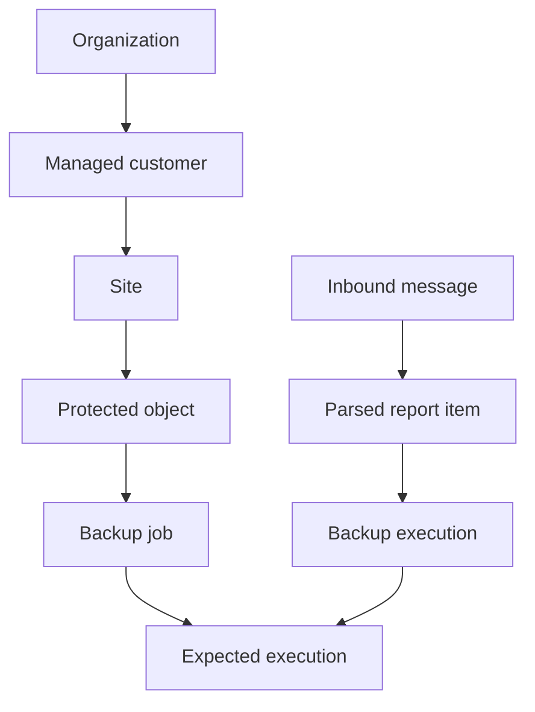
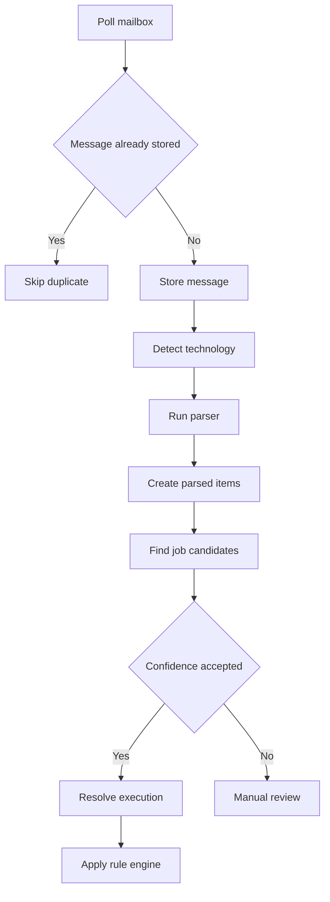
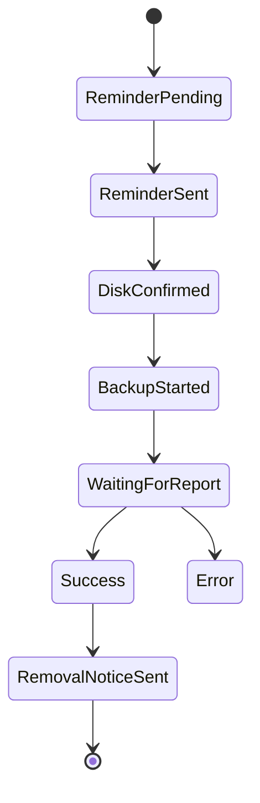

# Backup Control Center - Master Development Prompt

> Paste this file into the coding agent at the project root.
> It is the executable entry point for the project.

## 1. Current instruction

You are a senior product engineer and software architect.

Build **Backup Control Center**, an internal system for managing backup reports.
The first deployment will be tested inside one support company.
The long-term product may become a multitenant SaaS for MSPs and IT teams.

Execute only the phase marked as current.

This file is the controlling implementation prompt. If
`BACKUP_CONTROL_CENTER_SPEC.md` or other planning documents exist, treat them as
background context. When documents conflict, follow this file for implementation
order, scope, and stop conditions.

```text
CURRENT_PHASE=6
CURRENT_PHASE_NAME=Parser registry and manual review queue
STOP_AFTER_CURRENT_PHASE=true
```

Do not implement email ingestion, ManageEngine automation, billing, Redis,
Celery, PostgreSQL, cloud deployment, or the complete roadmap yet.

## 2. Quick path for the current phase

Extend the mailbox foundation with a parser registry and manual review queue:

1. Add normalized `ParsedReportItem` records linked to inbound messages.
2. Add parser and review status dimensions without creating ticket decisions.
3. Add a parser registry with a safe generic parser.
4. Do not implement provider-specific backup parsers until anonymized samples are
   available.
5. The generic parser must produce `UNKNOWN` with low confidence and require
   manual review.
6. Process unparsed inbound messages idempotently.
7. Add a tenant-scoped manual review queue for parsed items that need review.
8. Add tests for parser idempotency, safe unknown classification, review queue,
   and tenant isolation.

For phase 6, keep parsing operator-triggered. Do not add matching, rule engines,
ticket automation, external-backup automation, workers, or SaaS infrastructure.

The current phase is complete when an administrator can:

1. Process stored inbound messages through the parser registry.
2. See unknown or low-confidence parsed items in a manual review queue.
3. Mark a parsed item as reviewed without changing technical result semantics.
4. Confirm duplicate parsing does not create duplicate parsed items.
5. Confirm no generic parser result is marked as successful.
6. Pass all tests, including tenant-isolation tests.

Stop after satisfying those criteria.

Report the result using the format in section 30.

Sections 17, 19, 20, 21, 22, and 28 are product context unless the current phase
explicitly requires them. Do not create matching, rule engines, tickets,
external-backup automation, workers, or SaaS infrastructure during phase 6.

## 3. Operating rules for the coding agent

1. Inspect the repository before changing files.
2. Preserve existing user changes.
3. State assumptions before implementation.
4. Produce a short plan for the current phase.
5. Work only on the current phase.
6. Create migrations for every model change.
7. Add tests for domain and authorization behavior.
8. Run relevant tests before finishing.
9. Do not invent report formats.
10. Request anonymized samples before implementing parsers.
11. Never assume that one spreadsheet row equals one server.
12. Never use a hostname as the only unique identifier.
13. Keep business rules outside views and templates.
14. Keep parsers independent from the rule engine.
15. Keep ticket providers independent from the domain.
16. Keep email providers independent from the domain.
17. Include `organization_id` in tenant-owned data from day one.
18. Never mark an uncertain report as successful.
19. Prefer simple local infrastructure during the pilot.
20. Record architecture decisions as ADRs.

If information is missing but a safe local default exists, document the
assumption and continue. Ask the user only when the missing decision would
materially change the current phase.

## 4. Firm decisions for the pilot

These decisions are approved and should not be reopened during phase 1.

- The first deployment is local and internal.
- The application is a Django monolith.
- The initial database is SQLite.
- The interface uses Django templates and HTMX.
- The UI language is Spanish.
- Code identifiers, model names, migrations, tests, code comments, and developer
  documentation use English unless an existing project convention says otherwise.
- User-facing UI labels, validation messages, and help text use Spanish.
- The default timezone is `America/Argentina/Buenos_Aires`.
- The pilot has one organization.
- The data model still includes `Organization` and `Membership`.
- Public entity identifiers use UUIDs.
- One central application instance serves the internal network.
- One scheduler will be allowed when scheduled tasks are introduced.
- Ticket creation remains human-supervised during the pilot.
- Email access will be read-only.
- AI will not approve backup results.
- The spreadsheet remains available during the transition.
- The system must export operational results to Excel.
- Auditability is mandatory.

## 5. Deferred decisions for the SaaS

Do not implement these items during the local MVP unless a later phase says so.

- Cloud provider.
- Billing provider.
- Product prices.
- Exact plan limits.
- Object storage provider.
- SSO provider.
- PostgreSQL Row-Level Security.
- Kubernetes.
- Microservices.
- High availability.
- Public API.
- Customer portal.
- Mobile application.
- White labeling.
- Automated remediation.

The domain must allow these features later without implementing them now.

## 6. Pilot non-goals

The pilot must not:

- Execute backup jobs on protected systems.
- Connect remotely to servers to repair failures.
- Relaunch failed jobs automatically.
- Use AI to decide success or failure.
- Create tickets without operator confirmation.
- Support every backup technology on day one.
- Replace the spreadsheet without a parallel validation period.
- Store secrets in the repository.
- Run multiple background workers against SQLite.

## 7. Product context

The support team manages more than 600 servers and other protected resources.
Backup reports arrive by email and operators review them one by one.

Current technologies include:

- Iperius.
- Veeam.
- Azure Backup.
- Custom scripts.
- AWS DLM.
- QNAP.
- CubeBackup.
- Nakivo.

The current process is:

1. Read the report email.
2. Identify the customer, object, and backup job.
3. Interpret the result.
4. Update Excel.
5. Add an observation.
6. Compare with the previous scheduled execution.
7. Decide whether a ticket is needed.
8. Create or link a ManageEngine ticket.
9. Coordinate external-drive backups on scheduled days.

The desired result is an exception-based workflow.
Operators should review failures, warnings, missing reports, and uncertain
matches instead of reading every successful report.

## 8. Domain invariants

These rules are mandatory across all phases.

### 8.1 Protected resources

A backup is not always a server backup.

A protected object may be:

- A physical server.
- A virtual server.
- A virtual machine.
- An application.
- A database.
- A database instance.
- A folder or file set.
- A NAS.
- A Microsoft 365 tenant.
- A mailbox.
- An Azure resource.
- An AWS resource.
- A snapshot.
- Another digital resource.

### 8.2 Multiple relationships

- One host can contain many protected objects.
- One protected object can have many backup jobs.
- One backup job can protect many objects.
- One expected execution can use many inbound messages as evidence.
- One inbound message can contain many parsed report items.
- One parsed report item can support at most one real execution.
- A missing report is an operational state, not an email result.

### 8.3 Separate dimensions

Do not merge these dimensions into a single `type` field.

| Dimension | Examples |
| --- | --- |
| Technology | Veeam, Iperius, Azure, Nakivo |
| Protected object | Server, app, database, VM, tenant |
| Strategy | Full, incremental, differential, snapshot |
| Destination | Local, NAS, cloud, remote, external disk |
| Mode | Automatic, manual, assisted |
| Result | Success, warning, error, no report |

### 8.4 Ticket separation

The technical backup result and the ticket workflow are separate.

A backup remains in error even when it has a linked ticket.

## 9. Tenant terminology

### 9.1 Organization

The company using Backup Control Center.

The pilot has one organization. In the SaaS, each subscribing company is a
separate organization or tenant.

### 9.2 Managed customer

An end customer whose backups are managed by an organization.

Do not use `ManagedCustomer` as the tenant boundary.

### 9.3 Site

A physical or logical customer environment.

Examples include MDP, a datacenter, an Azure subscription, an AWS account, or a
Microsoft 365 tenant.

### 9.4 Protected object relation

Objects can be related with types such as:

- `HOSTS`.
- `RUNS_ON`.
- `PART_OF`.
- `DEPENDS_ON`.
- `OTHER`.

Examples:

```text
YAPP HOSTS SQL Server
ERP RUNS_ON YAPP
Hyper-V Cluster HOSTS YA02V
```

## 10. Corrected domain flow



The detailed report relationship is:

```text
INBOUND_MESSAGE
    -> PARSED_REPORT_ITEM
    -> BACKUP_EXECUTION
    -> EXPECTED_EXECUTION
```

Rules:

- One `InboundMessage` contains one or more `ParsedReportItem` records.
- A `ParsedReportItem` may remain unmatched.
- A matched item supports one `BackupExecution`.
- A `BackupExecution` can reference several parsed items as evidence.
- An `ExpectedExecution` has zero or one resolved `BackupExecution`.
- `NO_REPORT` is generated when the expected window expires.

## 11. Core data model

All tenant-owned models must include:

- `id` as UUID.
- `organization_id`.
- `created_at`.
- `updated_at`.
- Explicit status or `is_active`.

### 11.1 Identity and tenancy

- `Organization`.
- `User`.
- `Membership`.
- `Role`.

### 11.2 Managed inventory

- `ManagedCustomer`.
- `CustomerContact`.
- `Site`.
- `ProtectedObject`.
- `ProtectedObjectAlias`.
- `ObjectRelation`.

### 11.3 Backup configuration

- `BackupTechnology`.
- `BackupJob`.
- `BackupJobTarget`.
- `BackupSchedule`.
- `RetentionPolicy`.
- `BackupDestination`.
- `ReportExpectation`.

### 11.4 Backup operation

- `ExpectedExecution`.
- `BackupExecution`.
- `ExecutionObservation`.
- `ReviewDecision`.
- `TicketLink`.

### 11.5 Report ingestion

- `Connector`.
- `InboundMessage`.
- `MessageAttachment`.
- `ParsedReportItem`.
- `MatchingCandidate`.
- `ParserRule`.

### 11.6 External backups

- `ExternalBackupPlan`.
- `ExternalBackupCycle`.
- `ExternalBackupAction`.
- `NotificationTemplate`.
- `Notification`.

### 11.7 Platform support

- `AuditEvent`.
- `ImportBatch`.
- `ImportRow`.
- `ExportJob`.
- `FeatureFlag`.

Global catalogs may omit `organization_id` only when they contain no tenant
data. Tenant overrides must remain tenant-scoped.

## 12. Tenant-isolation rules

Apply these rules from phase 1.

1. Resolve the active organization from the authenticated membership.
2. Never trust an `organization_id` sent by the browser.
3. Scope every tenant-owned query by the active organization.
4. Include the organization in composite uniqueness constraints.
5. Include the organization in background-task payloads.
6. Include the organization in cache and storage paths.
7. Include the organization in audit events.
8. Use UUIDs in URLs and APIs.
9. Test access attempts across organizations.
10. Deny access when organization context is missing.

During phase 1, resolve the active organization from the user's membership. If a
user has multiple memberships in tests or seed data, require an explicit active
organization stored in the session instead of guessing.

Recommended initial model:

```python
class OrganizationOwnedModel(models.Model):
    organization = models.ForeignKey(
        "tenancy.Organization",
        on_delete=models.PROTECT,
    )

    class Meta:
        abstract = True
```

Do not depend only on a base model. Add scoped services, authorization checks,
and negative tests.

## 13. Backup configuration requirements

Each `BackupJob` must support the following groups.

### 13.1 General configuration

- Managed customer.
- Site.
- Job name.
- Technology.
- External identifier.
- Matching aliases.
- Status.
- Criticality.
- Internal owner.

### 13.2 Protected targets

- One or more protected objects.
- Target role.
- Included resources.
- Excluded resources.

### 13.3 Schedule

- Timezone.
- Frequency.
- Weekdays.
- Scheduled time.
- Optional cron expression.
- Expected duration.
- Report arrival deadline.
- Automatic or manual mode.

### 13.4 Strategy

- Full.
- Incremental.
- Differential.
- Snapshot.
- Image.
- Files.
- Database-aware.
- Application-aware.
- Other.

### 13.5 Protection controls

- Compression.
- Encryption.
- Immutability.
- Automatic verification.
- Application consistency.
- Exclusions.

### 13.6 Destination

- Repository type.
- Repository name.
- Location or region.
- Capacity.
- Free-space threshold.
- Local or offsite.

### 13.7 Retention

- Daily copies.
- Weekly copies.
- Monthly copies.
- Annual copies.
- Total days.
- GFS policy.
- Deleted-item retention.
- Special notes.

### 13.8 Operational review

- Last configuration review.
- Next review.
- Last restore test.
- Restore-test result.
- Optional RTO.
- Optional RPO.
- Documentation.
- Change ticket.

## 14. Spreadsheet import

Do not assume fixed column positions until a complete workbook is available.

The importer must support a mapping and preview step.

Observed examples include:

| Reference | Visible backup or component |
| --- | --- |
| YA01V | Azure |
| YA01V | NWBackup |
| YA02V | Hyper-V |
| YAFS | Historical documents |
| YAPP | SQL Server |
| YA02V | External backup on Friday |

The importer must:

- Forward-fill merged customer cells.
- Preserve repeated references.
- Avoid treating repeated references as duplicates automatically.
- Map customer, site, reference, object, job, and technology separately.
- Preview new, matched, incomplete, and conflicting rows.
- Save only after confirmation.
- Record an `ImportBatch` and per-row result.
- Allow a safe rollback of the import batch.

## 15. Inbound report pipeline

The future ingestion flow is:



Requirements:

- Read-only mailbox access.
- Configurable polling interval.
- Idempotency by connector and external message ID.
- SHA-256 hashes for attachments.
- Attachment size and type limits.
- Sanitized HTML rendering.
- No attachment execution.
- One message may create several parsed items.
- Several messages may support one execution.
- Raw evidence must remain traceable.

## 16. Parser contract

Parsers normalize evidence. They do not create tickets.

```python
@dataclass(frozen=True)
class ParsedBackupResult:
    provider: str
    source_message_id: str
    occurred_at: datetime | None
    parser_status: str
    customer_hints: list[str]
    object_hints: list[str]
    job_hints: list[str]
    summary: str
    error_code: str | None
    error_details: str | None
    warning_details: str | None
    metrics: dict[str, object]
    confidence: float
    parser_version: str
```

Allowed parser states:

- `SUCCESS`.
- `WARNING`.
- `FAILED`.
- `PARTIAL`.
- `UNKNOWN`.

Each parser requires anonymized fixtures for success, warning, failure, HTML,
plain text, attachments, and unexpected formats.

## 17. Status mapping

The parser, execution, review, and ticket states are different dimensions.

### 17.1 Parser-to-execution mapping

| Parser status | Execution status | Review required |
| --- | --- | --- |
| `SUCCESS` | `SUCCESS` | No, with high confidence |
| `WARNING` | `WARNING` | Rule-dependent |
| `FAILED` | `ERROR` | No, with high confidence |
| `PARTIAL` | `WARNING` or `ERROR` | Yes by default |
| `UNKNOWN` | `UNKNOWN` | Always |

Rules for the mapping:

- The confidence threshold is configurable and versioned.
- Low-confidence results always require review.
- `PARTIAL` requires a provider-specific rule or operator decision.
- `NO_REPORT` is never emitted by a parser.
- `NO_REPORT` is generated after an expected deadline expires.
- `MANUAL_REVIEW` belongs to review workflow, not technical execution.

### 17.2 Execution states

```text
PENDING
WAITING_REPORT
SUCCESS
WARNING
ERROR
NO_REPORT
UNKNOWN
JUSTIFIED
CANCELLED
```

### 17.3 Review states

```text
AUTO_VALIDATED
NEEDS_REVIEW
REVIEWED
REJECTED
```

### 17.4 Ticket states

```text
NONE
SUGGESTED
CREATE_PENDING
LINKED
CLOSED
```

## 18. Expected executions

Generate expected executions from active schedules.

Example:

```text
Job: Veeam daily
Days: Monday to Friday
Time: 23:00
Report deadline: 06:00 on the next day
Timezone: America/Argentina/Buenos_Aires
```

Compare an error with the previous scheduled execution.
Do not compare it blindly with the previous calendar day.

This distinction is required for weekends, holidays, and custom schedules.

## 19. Initial rule engine

| Current result | Previous result | Ticket | Action |
| --- | --- | --- | --- |
| Success | Any | None | Record success |
| Success | Error | Linked | Suggest recovery note |
| Warning | Any | Any | Record warning and details |
| Error | Success | None | First error, no ticket |
| Error | Warning | None | New error, no ticket by default |
| Error | Error | None | Suggest ticket for repetition |
| Error | Error | Linked | Keep ticket linked |
| No report | Any | Any | Require operational review |

Repetition is based on consecutive failures of the same `BackupJob`.
Do not require the literal error message to be identical.

Generated observations must keep these fields separate:

- System summary.
- Manual observation.
- Edit reason.
- Previous scheduled result.
- Ticket decision.

## 20. Manual-review queue

Send a report to review when:

- The technology is unknown.
- The message format is unknown.
- The managed customer is not found.
- The protected object is not found.
- The job is not found.
- Several candidates have similar scores.
- The result is contradictory.
- Confidence is below the threshold.
- A duplicate ID has different content.
- A report arrives outside an expected context.

An operator can:

- Select the correct customer, object, and job.
- Correct the result.
- Add an observation.
- Save a matching correction.
- Propose a reusable rule.

Reusable rules require supervisor approval.

## 21. ManageEngine integration

### 21.1 Pilot behavior

- Prepare the ticket subject and description.
- Allow content to be copied.
- Open the ManageEngine ticket page.
- Store a ticket ID manually.
- Link an existing ticket.
- Avoid duplicate active links for the same job.

### 21.2 Later provider interface

```python
class TicketProvider(Protocol):
    def search_open_ticket(self, context): ...
    def create_ticket(self, payload): ...
    def add_note(self, ticket_id, note): ...
    def get_ticket(self, ticket_id): ...
```

The provider abstraction must allow ManageEngine, ServiceNow, Jira Service
Management, Freshservice, and other systems later.

## 22. External-backup workflow



Store:

- Managed customer.
- Protected object.
- Related host.
- Schedule.
- Contact.
- Reminder lead time.
- Disk identifier or rotation.
- Procedure.
- Operator.
- Confirmations.
- Associated report.
- Removal notification.

Messages remain operator-approved during the pilot.

## 23. Pilot screens

Implement these screens gradually, according to the roadmap.

- Sign in.
- Dashboard.
- Daily control.
- Review queue.
- Managed customers.
- Sites.
- Protected objects.
- Object relations.
- Backup jobs.
- Expected executions.
- Inbound messages.
- Tickets.
- External backups.
- Imports.
- Exports.
- Audit log.
- Settings.

The UI should use dense but readable tables, persistent filters, keyboard
navigation, clear text labels, and direct links between evidence and results.

## 24. Local architecture

Use:

- Python 3.12 or later.
- Django.
- Django templates.
- HTMX.
- SQLite.
- `openpyxl` for spreadsheets.
- `pytest` and `pytest-django`.
- A single scheduler when scheduling is introduced.

SQLite rules:

- One application instance.
- One scheduler.
- Short transactions.
- WAL mode.
- A configured busy timeout.
- No concurrent parser workers.
- Daily verified database backup.

Suggested project structure:

```text
backup-control-center/
├── config/
├── apps/
│   ├── accounts/
│   ├── tenancy/
│   ├── customers/
│   ├── inventory/
│   ├── backups/
│   ├── ingestion/
│   ├── parsers/
│   ├── matching/
│   ├── rules/
│   ├── tickets/
│   ├── external_backups/
│   ├── reporting/
│   └── audit/
├── templates/
├── static/
├── tests/
├── fixtures/
├── docs/
└── runtime/
```

## 25. Security from the pilot onward

Security for real connectors is not deferred until the SaaS.

### 25.1 Local secret policy

- Keep `.env` outside version control.
- Restrict `.env` with operating-system ACLs.
- Use a dedicated service account where possible.
- Give mailbox credentials read-only scope.
- Rotate secrets manually during the pilot.
- Never log passwords, refresh tokens, or authorization headers.
- Never include secrets in exports or audit diffs.

### 25.2 OAuth token policy

- Do not store OAuth tokens as plaintext application fields.
- Encrypt tokens before database persistence.
- Keep the encryption key outside SQLite.
- Prefer an OS secret store for the local master key.
- Record token rotation without recording token values.

### 25.3 Local file policy

- Restrict the runtime directory to the service account and administrators.
- Treat email bodies and attachments as sensitive evidence.
- Sanitize HTML before display.
- Never execute attachments.
- Validate size, extension, and content type.

### 25.4 Database-backup policy

- Use SQLite's safe backup mechanism.
- Run `PRAGMA integrity_check` on generated copies.
- Encrypt backups that contain real evidence.
- Keep the backup key separate from backup files.
- Prefer full-disk encryption such as BitLocker or LUKS.
- Define and test a restore procedure.

## 26. Test requirements

The test suite must cover:

- Tenant isolation.
- Permission checks.
- Object relationships.
- Multiple jobs per object.
- Multiple objects per job.
- Schedule generation.
- Weekend and timezone behavior.
- Parser fixtures.
- Message deduplication.
- One message with several report items.
- Several messages for one execution.
- Parser-status mapping.
- Consecutive error rules.
- Missing reports.
- Ticket duplication prevention.
- Spreadsheet import preview.
- External-backup transitions.

Use golden fixtures for provider parsers.
Aim for at least 80 percent coverage in domain services.

## 27. Delivery roadmap

Only the current phase may be implemented in one run.

### 27.1 Phase 0 - Discovery

- Collect an anonymized workbook.
- Collect report samples by provider and result.
- Confirm the mailbox platform.
- Confirm the ManageEngine edition and API.
- Rank technologies by message volume.

### 27.2 Phase 1 - Foundation

- Bootstrap Django and SQLite.
- Implement authentication.
- Implement organization and membership.
- Implement customer, site, and protected object.
- Implement object relations.
- Add tenant-isolation tests.

This is the current phase.

### 27.3 Phase 2 - Backup inventory

- Add technologies and backup jobs.
- Add multiple targets.
- Add schedules, destinations, and retention.
- Add configuration history.

### 27.4 Phase 3 - Spreadsheet and manual control

- Add the import wizard.
- Add the daily-control table.
- Allow manual results.
- Add Excel export.

### 27.5 Phase 4 - Expected executions

- Generate expected executions.
- Apply report deadlines.
- Detect missing reports.
- Add the initial dashboard.

### 27.6 Phase 5 - Email and parsers

- Add one read-only connector.
- Add idempotent message storage.
- Add the parser registry.
- Implement the highest-volume parsers.
- Add matching and manual review.

### 27.7 Phase 6 - Rules and tickets

- Add status mapping.
- Add the rule engine.
- Add generated observations.
- Add supervised ticket suggestions.

### 27.8 Phase 7 - External backups

- Add plans and cycles.
- Add reminders and confirmations.
- Link reports.
- Add removal notifications.

### 27.9 Phase 8 - Parallel pilot

- Run Excel and the system together.
- Compare results for two or three weeks.
- Measure parser precision.
- Correct false matches.
- Approve automation thresholds.

### 27.10 Phase 9 - Stable internal product

- Migrate to PostgreSQL.
- Add Redis and background workers.
- Complete the ManageEngine API integration.
- Add monitoring and recovery procedures.

### 27.11 Phase 10 - SaaS beta

- Validate multitenant isolation.
- Add tenant onboarding.
- Encrypt connector credentials.
- Add object storage.
- Add usage limits and entitlements.
- Add subscriptions.

### 27.12 Phase 11 - Final product

- Add SSO and MFA.
- Add a customer portal.
- Add custom roles.
- Add more ticket providers.
- Add public APIs and webhooks.
- Add RPO and RTO reporting.
- Add restore-test management.
- Add capacity forecasting.
- Add high availability.
- Add controlled remediation.

## 28. SaaS architecture direction

When the pilot is validated, evolve toward:

- PostgreSQL with a shared schema.
- `organization_id` on tenant-owned tables.
- Composite indexes beginning with the organization.
- Redis.
- Background workers.
- Object storage namespaced by organization.
- Encrypted connector credentials.
- Feature flags and entitlements.
- Central metrics and logs.
- Optional PostgreSQL Row-Level Security.

Do not use scattered checks such as:

```python
if plan == "pro":
    enable_feature()
```

Use a service boundary:

```python
entitlements.can_use(
    organization=organization,
    feature="custom_parsers",
)
```

Future usage metrics may include:

- Active protected objects.
- Active backup jobs.
- Monthly processed reports.
- Users.
- Connectors.
- Evidence retention days.
- Storage usage.

Do not assign prices during the pilot.

## 29. Global MVP acceptance criteria

The local MVP is complete when it can:

1. Import the current workbook with preview.
2. Register customers, sites, objects, and relations.
3. Store multiple jobs per object.
4. Store multiple objects per job.
5. Store schedule, destination, strategy, and retention.
6. Generate expected executions.
7. Read messages without duplicates.
8. Parse the highest-volume formats.
9. Map parser states consistently.
10. Detect missing reports.
11. Require review for uncertain results.
12. Detect consecutive failures.
13. Suggest a ticket.
14. Link a ManageEngine ID.
15. Manage an external-backup cycle.
16. Export the daily control to Excel.
17. Keep an audit trail.
18. Back up SQLite safely.
19. Prevent cross-organization access.
20. Operate from one local central instance.

## 30. Required completion report

At the end of the current phase, return:

```text
Outcome
- What is now working.

Changed files
- Important files created or modified.

Data model
- Models and migrations added.

Verification
- Commands executed.
- Test results.

Assumptions
- Safe assumptions made.

Deferred work
- Items intentionally left for later phases.

Next phase
- Proposed next step, without implementing it.
```

Do not claim completion when tests fail or acceptance criteria are unmet.

## 31. Final instruction

Start with phase 1 only.

Do not start report ingestion yet.
Do not start the SaaS infrastructure yet.
Do not implement future roadmap items preemptively.

Build a clean tenant-aware foundation that can support the complete product
without making the pilot unnecessarily complex.
