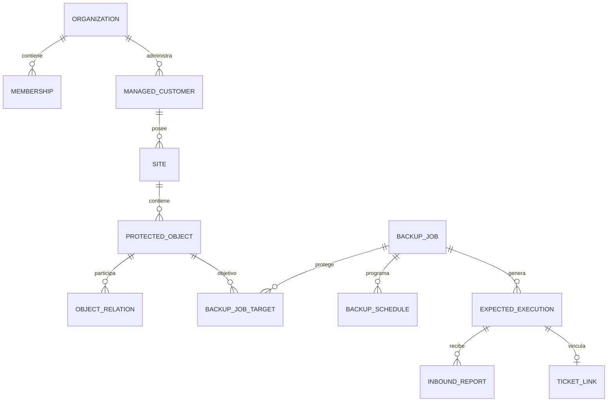
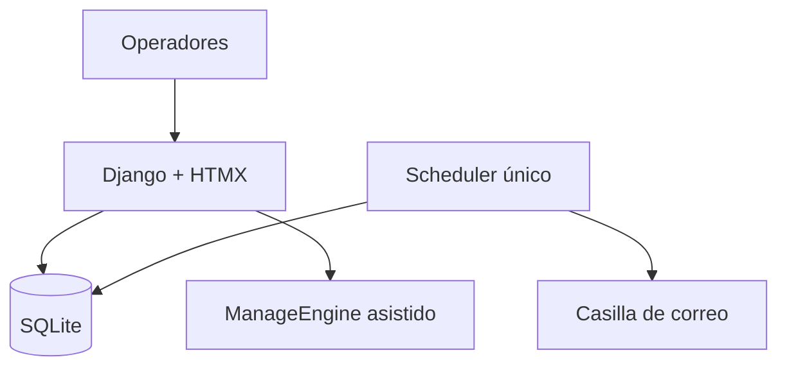
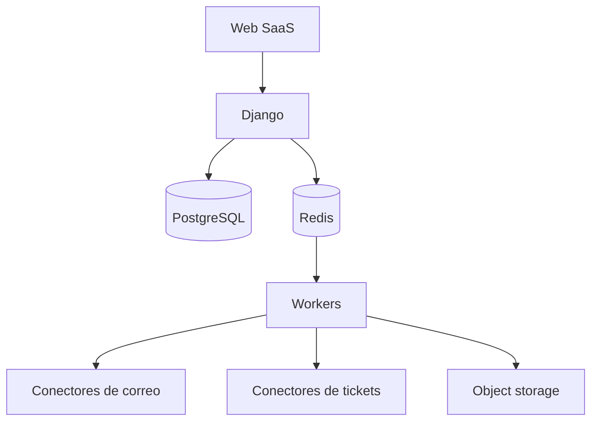
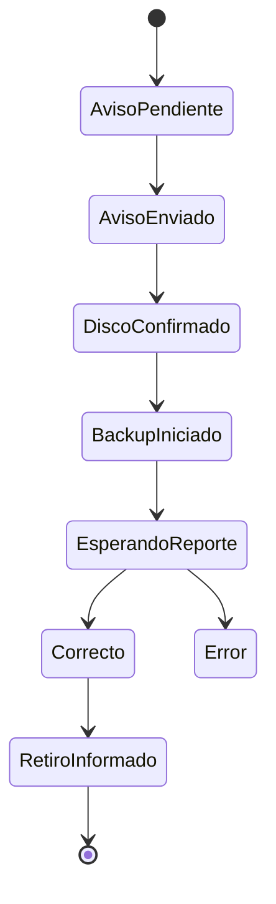
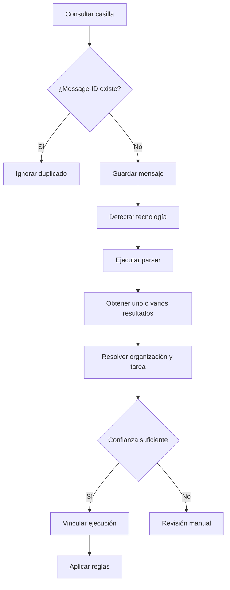

# Backup Control Center

> Especificación funcional y técnica desde el piloto local hasta el producto SaaS multitenant.

| Dato | Valor |
|---|---|
| Estado | Documento inicial de producto y arquitectura |
| Versión | 0.1 |
| Fecha | 20 de julio de 2026 |
| Primera implementación | Piloto interno en una única organización |
| Base de datos inicial | SQLite |
| Evolución prevista | PostgreSQL + arquitectura multitenant SaaS |

---

## 1. Visión del producto

Backup Control Center será una plataforma para centralizar, automatizar y auditar la operación diaria de backups administrados por equipos de soporte, infraestructura y proveedores de servicios gestionados.

El sistema deberá responder rápidamente:

- ¿Qué backups deberían ejecutarse hoy?
- ¿Qué reportes llegaron y cuáles faltan?
- ¿Qué objetos están correctamente protegidos?
- ¿Qué errores ocurrieron por primera vez?
- ¿Qué errores se repitieron y requieren ticket?
- ¿Qué ticket está asociado con cada problema?
- ¿Qué backup externo debe coordinarse hoy?
- ¿Cuál es la configuración, retención y destino de cada copia?
- ¿Cuándo se realizó la última prueba de restauración?

La primera versión se probará internamente con una sola organización y SQLite. Sin embargo, el modelo de dominio debe incluir desde el primer día el concepto de `Organization`, para evitar una reescritura completa cuando el producto se ofrezca como SaaS.

## 2. Problema actual

La operación actual administra más de 600 servidores y otros objetos protegidos. Los reportes llegan por correo y son revisados manualmente uno por uno.

El flujo actual incluye:

1. Leer cada correo de backup.
2. Identificar cliente, referencia, objeto y tarea.
3. Interpretar el estado del reporte.
4. Marcar el resultado en Excel.
5. Escribir una observación.
6. Comparar contra la ejecución anterior.
7. Decidir si corresponde crear un ticket.
8. Crear o vincular el ticket en ManageEngine.
9. Gestionar recordatorios y confirmaciones de backups externos.

Este proceso consume tiempo, depende del criterio humano, puede producir diferencias entre operadores y no ofrece una trazabilidad completa entre configuración, correo, ejecución, observación y ticket.

## 3. Objetivos

### 3.1 Objetivo del piloto

Validar en el entorno de trabajo que el sistema puede reemplazar gran parte de la revisión manual sin introducir riesgos operativos.

### 3.2 Objetivo del MVP

Permitir que el equipo comience la jornada desde un dashboard, revise únicamente excepciones y complete el control diario sin recorrer cada correo manualmente.

### 3.3 Objetivo del producto final

Ofrecer una plataforma SaaS multitenant para empresas de soporte, MSP, áreas de infraestructura y organizaciones que gestionan backups de múltiples clientes, sedes, servidores, aplicaciones y servicios cloud.

## 4. Principios del producto

1. **Configuración y ejecución son conceptos diferentes.** La configuración define qué debería ocurrir. La ejecución registra qué ocurrió realmente.
2. **El servidor no es la única unidad protegida.** Se deben admitir aplicaciones, bases de datos, VM, carpetas, tenants, NAS, snapshots, cuentas cloud y otros objetos.
3. **Puede haber múltiples backups en un mismo host.** Un host puede contener varios objetos y cada objeto puede tener varias configuraciones.
4. **Una configuración puede proteger varios objetos.** Por ejemplo, una tarea Veeam puede incluir varias VM.
5. **El ticket no define el estado del backup.** Un backup sigue en error aunque tenga un ticket vinculado.
6. **Las decisiones automáticas deben ser explicables.** Cada resultado debe indicar qué parser, regla y evidencia fueron utilizados.
7. **Los casos ambiguos requieren revisión humana.** Un resultado incierto nunca debe convertirse automáticamente en correcto.
8. **Toda operación sensible debe quedar auditada.**
9. **El piloto será simple, pero el dominio debe estar preparado para multitenancy.**
10. **La migración desde Excel debe ser gradual y reversible.**

## 5. Alcance del producto

### 5.1 Incluido en el MVP

- Autenticación y roles internos.
- Organización única creada automáticamente para el piloto.
- Clientes gestionados.
- Sedes y entornos.
- Objetos protegidos y relaciones con hosts.
- Configuraciones completas de backup.
- Múltiples configuraciones por objeto.
- Múltiples objetos por configuración.
- Programaciones y ejecuciones esperadas.
- Importación del Excel actual.
- Exportación diaria a Excel.
- Conexión de solo lectura con una casilla.
- Procesamiento idempotente de correos.
- Parsers para las tecnologías de mayor volumen.
- Clasificación normalizada de resultados.
- Detección de reportes no recibidos.
- Comparación con la ejecución programada anterior.
- Motor de reglas para errores consecutivos.
- Observaciones automáticas.
- Bandeja de revisión manual.
- Cola de tickets por crear.
- Registro y vinculación de tickets de ManageEngine.
- Gestión de backups externos.
- Auditoría.
- Backup automático de SQLite.

### 5.2 Fuera del MVP inicial

- Ejecución automática de tareas dentro de servidores.
- Reparación o relanzamiento automático de backups.
- Inteligencia artificial aprobando ejecuciones.
- Aplicación móvil.
- Portal para clientes.
- Facturación SaaS.
- Alta disponibilidad.
- Aislamiento físico por base de datos.
- Analítica predictiva.
- Todos los parsers desde el primer lanzamiento.
- PostgreSQL, Redis y workers distribuidos durante la primera prueba local.

## 6. Glosario y modelo conceptual

### 6.1 Organización o tenant

Empresa que utiliza la plataforma. Durante el piloto existirá una sola organización. En el SaaS, cada empresa usuaria será un tenant independiente.

No debe confundirse con los clientes administrados por esa empresa.

### 6.2 Cliente gestionado

Cliente final cuyos backups administra la organización. Una organización puede administrar cientos de clientes.

### 6.3 Sede o entorno

Ubicación física o lógica del cliente: MDP, Buenos Aires, datacenter, tenant de Microsoft 365, cuenta AWS, suscripción Azure u otro entorno.

### 6.4 Objeto protegido

Recurso cuya información se respalda.

Tipos iniciales:

- Servidor físico.
- Servidor virtual.
- Máquina virtual.
- Aplicación.
- Base de datos.
- Instancia de base de datos.
- Carpeta o conjunto de archivos.
- NAS.
- Tenant de Microsoft 365.
- Buzón o cuenta.
- Recurso Azure.
- Recurso AWS.
- Snapshot.
- Repositorio.
- Otro.

### 6.5 Host relacionado

Infraestructura donde reside un objeto protegido. Es opcional porque algunos objetos, como Microsoft 365 o un recurso SaaS, no tienen un servidor administrado directamente.

Ejemplos:

- Una aplicación se aloja en `YAPP`.
- SQL Server se ejecuta dentro de `YAPP`.
- Varias VM pertenecen a un cluster Hyper-V.
- Un tenant de Microsoft 365 no tiene un host local.

### 6.6 Configuración o tarea de backup

Define el motor, alcance, estrategia, programación, destino, retención y reglas de reporte.

### 6.7 Ejecución esperada

Instancia que el sistema genera a partir de una programación. Representa el reporte que debería recibirse.

### 6.8 Ejecución real

Resultado asociado con una ejecución esperada. Puede tener uno o varios correos como evidencia.

### 6.9 Tecnología de backup

Herramienta o mecanismo que genera la copia o su reporte:

- Iperius.
- Veeam.
- Azure Backup.
- Scripts propios.
- AWS DLM.
- QNAP.
- CubeBackup.
- Nakivo.
- Otro.

### 6.10 Dimensiones que no deben mezclarse

| Dimensión | Ejemplos |
|---|---|
| Tecnología | Veeam, Iperius, Azure, Nakivo |
| Objeto protegido | Servidor, app, base, VM, archivos, tenant |
| Estrategia | Full, incremental, diferencial, snapshot |
| Destino | Local, NAS, cloud, remoto, disco externo |
| Modalidad | Automática, manual, asistida |
| Resultado | Correcto, warning, error, sin reporte |

## 7. Relación entre entidades



Reglas de cardinalidad importantes:

- Una organización tiene muchos clientes gestionados.
- Un cliente puede tener varias sedes o entornos.
- Una sede contiene muchos objetos protegidos.
- Un objeto puede relacionarse con otro objeto mediante `HOSTS`, `PART_OF`, `DEPENDS_ON` u otra relación.
- Una tarea de backup puede proteger uno o varios objetos.
- Un objeto puede tener una o varias tareas de backup.
- Una ejecución puede relacionarse con uno o varios correos.
- Un error puede tener cero o un ticket activo vinculado en el MVP.

## 8. Referencia del Excel actual

El importador no debe asumir columnas fijas hasta revisar la planilla completa. Debe ofrecer un paso de mapeo y previsualización.

En el ejemplo actual se observan patrones como:

| Cliente | Sede | Referencia | Backup o componente | Resultado |
|---|---|---|---|---|
| Canteras Yaraví | MDP | YA01V | Azure | Correcto |
| Canteras Yaraví | MDP | YA01V | NWBackup | Correcto |
| Canteras Yaraví | MDP | YA02V | Hyper-V | Correcto |
| Canteras Yaraví | MDP | YAFS | Histórico Documentos | Warning |
| Canteras Yaraví | MDP | YAPP | SQL Server | Correcto |
| Canteras Yaraví | MDP | YA02V | Externo (viernes) | Correcto |

Esto demuestra que:

- La referencia puede repetirse.
- Un mismo host puede tener varios backups.
- El nombre visible puede representar una tecnología, una tarea o un componente.
- No se puede usar únicamente el hostname como clave única.
- Las celdas combinadas del cliente deben completarse hacia abajo durante la importación.

### 8.1 Importación propuesta

El asistente de importación deberá permitir mapear:

- Organización.
- Cliente gestionado.
- Sede.
- Referencia o alias.
- Host relacionado.
- Objeto protegido.
- Nombre de tarea.
- Tecnología.
- Operador.
- Estado actual.
- Ticket.
- Observación.

Antes de guardar debe mostrar:

- Registros nuevos.
- Coincidencias existentes.
- Posibles duplicados.
- Datos incompletos.
- Valores no reconocidos.
- Acciones que se realizarán.

## 9. Arquitectura evolutiva

### 9.1 Etapa 1: piloto local



Componentes:

- Django.
- Django Templates.
- HTMX.
- Bootstrap o Tailwind CSS.
- SQLite.
- Un único scheduler.
- Importación y exportación con `openpyxl`.
- Archivos locales para correos y adjuntos.
- Una única organización precargada.

Condiciones para usar SQLite:

- Una sola instancia de aplicación.
- Un solo scheduler.
- Transacciones cortas.
- Modo WAL y `busy_timeout` configurado.
- Sin workers paralelos procesando correos.
- Backup diario de la base.

### 9.2 Etapa 2: producto interno estable

- PostgreSQL.
- Redis.
- Celery y Celery Beat, o alternativa equivalente.
- Almacenamiento interno para adjuntos.
- Integración completa con ManageEngine.
- Más parsers.
- Métricas y alertas operativas.
- Despliegue en servidor interno con Docker.

### 9.3 Etapa 3: SaaS multitenant



- Esquema compartido con `organization_id`.
- Aislamiento obligatorio por organización.
- Almacenamiento de objetos con prefijo por tenant.
- Credenciales cifradas por conector.
- Planes y límites.
- Facturación.
- Onboarding autoservicio.
- Observabilidad centralizada.
- Backups y recuperación del servicio.
- Despliegue cloud con alta disponibilidad.

## 10. Estrategia multitenant desde el primer día

### 10.1 Modelo recomendado

Para la primera versión SaaS se recomienda:

- Una base PostgreSQL compartida.
- Un esquema compartido.
- Una columna `organization_id` en todas las entidades de negocio.
- Índices compuestos comenzando por `organization_id`.
- Restricciones de unicidad dentro de la organización.

Ejemplo:

```python
UniqueConstraint(
    fields=["organization", "managed_customer", "external_reference"],
    name="uq_asset_reference_per_organization",
)
```

### 10.2 Piloto single-tenant sobre modelo multitenant

Aunque el piloto tenga una sola empresa:

1. Crear una `Organization` inicial.
2. Asociar todos los usuarios mediante `Membership`.
3. Asociar clientes, objetos, jobs, ejecuciones y conectores con esa organización.
4. Nunca consultar tablas de negocio sin filtrar por organización.
5. No codificar el ID de la organización en las vistas.

### 10.3 Reglas obligatorias de aislamiento

- Todo request autenticado debe resolver una organización activa.
- Los IDs externos deben ser UUID.
- Ninguna API debe aceptar un `organization_id` arbitrario del frontend.
- La organización se obtiene desde la sesión o el token.
- Toda tarea en background debe transportar el `organization_id`.
- Las claves de caché deben incluir el tenant.
- Las rutas de archivos deben usar `organizations/{uuid}/...`.
- Los conectores deben pertenecer a una organización.
- Las exportaciones deben filtrar por organización.
- La auditoría debe guardar organización y actor.
- Deben existir tests automáticos que intenten acceso cruzado.

### 10.4 Evolución de seguridad

Durante el piloto se utilizará filtrado a nivel de aplicación. Antes de ofrecer el SaaS se evaluará agregar Row-Level Security de PostgreSQL como defensa adicional.

### 10.5 Onboarding futuro de una organización

El alta SaaS deberá guiar al administrador por:

1. Crear la organización.
2. Definir zona horaria y reglas predeterminadas.
3. Invitar operadores.
4. Configurar una casilla o conector.
5. Configurar el proveedor de tickets.
6. Importar clientes, objetos y tareas.
7. Probar el matching con reportes históricos.
8. Ejecutar un modo sombra sin decisiones automáticas.
9. Aprobar parsers y reglas.
10. Activar el control productivo.

### 10.6 Planes, límites y medición

No se implementará facturación en el piloto, pero el SaaS deberá poder medir por organización:

- Objetos protegidos activos.
- Tareas activas.
- Reportes procesados por mes.
- Conectores habilitados.
- Usuarios.
- Días de retención de evidencia.
- Almacenamiento utilizado.
- Parsers premium o personalizados.

Los límites deben resolverse mediante `EntitlementService` y feature flags. La lógica del producto no debe contener condiciones dispersas como `if plan == "pro"`.

Posibles niveles, sin definir todavía precios:

| Plan | Orientación |
|---|---|
| Starter | Equipo pequeño que administra su propia infraestructura |
| Professional | Área de soporte con múltiples clientes y conectores |
| MSP | Gran cantidad de clientes, automatizaciones y marca propia |
| Enterprise | SSO, auditoría extendida, SLA y límites personalizados |

### 10.7 Administración de plataforma

El producto final necesitará un plano administrativo separado para:

- Crear, suspender y reactivar tenants.
- Consultar consumo sin acceder al contenido operativo salvo soporte autorizado.
- Gestionar planes y entitlements.
- Ver salud de conectores y workers.
- Aplicar feature flags.
- Ejecutar soporte con acceso temporal, explícito y auditado.
- Gestionar incidentes de plataforma.

### 10.8 Portabilidad y baja

Cada organización debe poder:

- Exportar su inventario y configuraciones.
- Exportar historial según su plan y retención.
- Desconectar credenciales.
- Solicitar eliminación.
- Recibir confirmación de borrado.

La suspensión comercial no debe eliminar inmediatamente la información. Debe existir un ciclo de retención, recuperación y eliminación definitiva configurable.

## 11. Usuarios, membresías y roles

### 11.1 Roles iniciales

| Rol | Permisos principales |
|---|---|
| Administrador | Configuración, usuarios, conectores, importaciones y todas las operaciones |
| Supervisor | Reglas, revisiones, tickets, reportes y aprobaciones |
| Operador | Control diario, correcciones, observaciones, backups externos y tickets asistidos |
| Consulta | Lectura de dashboard, historial y configuraciones |

### 11.2 Futuro SaaS

- Owner de la organización.
- Administrador del tenant.
- Manager.
- Operador.
- Auditor.
- Cliente externo con acceso limitado.
- Roles personalizados por plan.

Los permisos deben comprobarse en el backend, no solamente ocultarse en la interfaz.

## 12. Módulos del MVP

### 12.1 Dashboard

Debe mostrar:

- Ejecuciones esperadas.
- Correctos.
- Warnings.
- Errores nuevos.
- Errores consecutivos.
- Sin reporte.
- Pendientes.
- Revisión manual.
- Tickets por crear.
- Backups externos del día.

Filtros:

- Fecha.
- Cliente gestionado.
- Sede.
- Objeto protegido.
- Host relacionado.
- Tecnología.
- Estado.
- Con ticket o sin ticket.
- Automático o externo.
- Responsable.

### 12.2 Clientes gestionados

Campos mínimos:

- Organización.
- Nombre.
- Código interno.
- Estado.
- Contactos.
- Correos.
- Teléfonos.
- Zona horaria.
- Observaciones.

### 12.3 Sedes y entornos

- Cliente.
- Nombre.
- Código.
- Tipo.
- Zona horaria.
- Dirección opcional.
- Estado.
- Observaciones.

### 12.4 Objetos protegidos

- Organización.
- Cliente.
- Sede.
- Nombre.
- Referencia externa.
- Tipo.
- Hostname opcional.
- IP opcional.
- Plataforma.
- Criticidad.
- Estado.
- Responsable.
- Alias para matching.
- Objeto padre opcional.
- Observaciones.

### 12.5 Relaciones entre objetos

Tipos iniciales:

- `HOSTS`.
- `PART_OF`.
- `DEPENDS_ON`.
- `RUNS_ON`.
- `PROTECTS`.
- `OTHER`.

Ejemplos:

- `YAPP HOSTS SQL Server`.
- `Cluster Hyper-V HOSTS YA02V`.
- `Aplicación ERP RUNS_ON YAPP`.

### 12.6 Configuración de backup

#### Datos generales

- Organización.
- Cliente.
- Nombre de tarea.
- Tecnología.
- Identificador externo.
- Alias de matching.
- Estado.
- Criticidad.
- Responsable interno.

#### Objetivos protegidos

- Uno o varios objetos.
- Rol del objetivo dentro de la tarea.
- Inclusiones.
- Exclusiones.

#### Programación

- Zona horaria.
- Frecuencia.
- Días.
- Hora.
- Expresión cron opcional.
- Ventana de ejecución.
- Margen para recibir el reporte.
- Ejecución automática o manual.
- Duración habitual.

#### Estrategia

- Full.
- Incremental.
- Diferencial.
- Snapshot.
- Imagen.
- Archivos.
- Base de datos.
- Aplicación.
- Otro.

#### Controles

- Compresión.
- Cifrado.
- Inmutabilidad.
- Verificación automática.
- Consistencia de aplicación.
- Exclusiones.

#### Destino

- Tipo de repositorio.
- Nombre.
- Ubicación.
- Región.
- Capacidad.
- Umbral de espacio libre.
- Local o externo.
- Offsite.

#### Retención

- Diarias.
- Semanales.
- Mensuales.
- Anuales.
- Días totales.
- GFS.
- Retención de eliminados.
- Reglas especiales.

#### Control operativo

- Última revisión de configuración.
- Próxima revisión.
- Última prueba de restauración.
- Resultado de restauración.
- RTO opcional.
- RPO opcional.
- Documentación.
- Ticket de implementación o modificación.

### 12.7 Control diario

Columnas sugeridas:

- Cliente.
- Sede.
- Objeto o referencia principal.
- Tarea.
- Tecnología.
- Hora esperada.
- Hora recibida.
- Resultado.
- Revisión.
- Ticket.
- Responsable.
- Observación.

Acciones:

- Ver correo.
- Ver adjuntos.
- Corregir resultado.
- Editar observación.
- Vincular ticket.
- Preparar ticket.
- Marcar revisado.
- Justificar ausencia.

### 12.8 Bandeja de revisión

Casos incluidos:

- Proveedor desconocido.
- Tecnología conocida con formato desconocido.
- Cliente no encontrado.
- Objeto no encontrado.
- Varias coincidencias.
- Tarea no encontrada.
- Resultado contradictorio.
- Confianza baja.
- Correo inesperado.
- Reporte duplicado con contenido diferente.

### 12.9 Tickets

El MVP debe permitir:

- Sugerir creación por repetición.
- Mostrar contexto del error.
- Copiar asunto y descripción.
- Abrir ManageEngine.
- Registrar ID.
- Vincular ticket existente.
- Evitar duplicados.
- Justificar que no corresponde crear ticket.
- Registrar recuperación.

### 12.10 Backups externos

Estados:



Datos:

- Cliente.
- Objeto protegido.
- Host relacionado.
- Día y hora.
- Contacto.
- Anticipación.
- Identificación o rotación del disco.
- Plantillas.
- Procedimiento.
- Operador.
- Confirmaciones.
- Reporte asociado.

### 12.11 Reportes y exportaciones

- Control diario.
- Errores.
- Warnings.
- Sin reporte.
- Tickets.
- Historial por cliente.
- Historial por objeto.
- Historial por host.
- Configuraciones.
- Calendario de backups externos.
- Resumen ejecutivo diario.

### 12.12 Auditoría

Debe registrar:

- Organización.
- Usuario o sistema.
- Acción.
- Entidad.
- ID de entidad.
- Valor anterior.
- Valor nuevo.
- Motivo.
- Fecha y hora.
- IP o contexto de origen cuando corresponda.

## 13. Flujo de procesamiento de correos



### 13.1 Requisitos

- Conexión de solo lectura.
- Polling configurable, inicialmente cada 2 a 5 minutos.
- Idempotencia por conector y `external_message_id`.
- Hash SHA-256 de adjuntos.
- Límite de tamaño.
- Sanitización de HTML.
- Prohibición de ejecutar adjuntos.
- Conservación del mensaje original o referencia verificable.
- Posibilidad de que un correo contenga varios resultados.
- Posibilidad de que una ejecución tenga varios correos.

## 14. Contrato de parsers

Cada parser debe transformar un mensaje en uno o varios objetos normalizados.

```python
@dataclass(frozen=True)
class ParsedBackupResult:
    provider: str
    source_message_id: str
    occurred_at: datetime | None
    normalized_status: str
    customer_hints: list[str]
    object_hints: list[str]
    job_hints: list[str]
    summary: str
    error_code: str | None
    error_details: str | None
    warning_details: str | None
    metrics: dict[str, object]
    confidence: float
    parser_version: str
```

Estados permitidos por el parser:

- `SUCCESS`.
- `WARNING`.
- `FAILED`.
- `PARTIAL`.
- `UNKNOWN`.

El parser no decide si se crea un ticket. Esa decisión pertenece al motor de reglas.

### 14.1 Parsers iniciales

Implementar en orden de volumen real:

1. Tecnología con mayor cantidad de reportes.
2. Segunda tecnología con mayor cantidad.
3. Tercera tecnología con mayor cantidad.
4. Parser genérico configurable.
5. Resto de proveedores.

Cada parser debe tener fixtures anonimizados de:

- Correcto.
- Warning.
- Error.
- HTML.
- Texto plano.
- Adjunto.
- Formato inesperado.
- Variación de idioma, si existe.

## 15. Matching de reportes

Orden recomendado:

1. Identificador externo exacto de la tarea.
2. Regla específica del conector.
3. Remitente y patrón de asunto.
4. Alias de tarea.
5. Alias de objeto protegido.
6. Alias de host.
7. Cliente y sede.
8. Revisión manual.

El sistema debe guardar:

- Candidatos encontrados.
- Puntuación.
- Regla ganadora.
- Evidencia utilizada.
- Corrección manual.

Las correcciones manuales pueden crear una regla futura, pero requieren permiso de supervisor.

## 16. Ejecuciones esperadas

Cada programación activa genera una ejecución esperada.

Ejemplo:

```text
Tarea: Veeam diario
Días: lunes a viernes
Hora: 23:00
Margen de recepción: hasta las 06:00 del día siguiente
Zona horaria: America/Argentina/Buenos_Aires
```

Estados operativos:

- `PENDING`.
- `WAITING_REPORT`.
- `SUCCESS`.
- `WARNING`.
- `ERROR`.
- `NO_REPORT`.
- `MANUAL_REVIEW`.
- `JUSTIFIED`.
- `CANCELLED`.

La comparación se realiza contra la ejecución programada anterior, no contra el día calendario anterior.

## 17. Motor de reglas

El estado técnico, el estado de revisión y el estado del ticket deben almacenarse por separado.

### 17.1 Estados independientes

```text
execution_status: SUCCESS | WARNING | ERROR | NO_REPORT | UNKNOWN
review_status: AUTO_VALIDATED | NEEDS_REVIEW | REVIEWED
ticket_status: NONE | SUGGESTED | LINKED | CREATE_PENDING | CLOSED
```

### 17.2 Reglas iniciales

| Hoy | Ejecución programada anterior | Ticket | Acción |
|---|---|---|---|
| Correcto | Cualquiera | No | Registrar correcto |
| Correcto | Error | Sí | Registrar recuperación y sugerir actualización |
| Warning | Cualquiera | Cualquiera | Registrar warning y observación |
| Error | Correcto | No | Primer error, no crear ticket |
| Error | Warning | No | Error nuevo, no crear ticket por defecto |
| Error | Error | No | Sugerir ticket por repetición |
| Error | Error | Sí | Mantener ticket y actualizar observación |
| Sin reporte | Cualquiera | Cualquiera | Enviar a revisión |

La repetición se calcula sobre la tarea o configuración, no comparando literalmente el texto del error.

### 17.3 Observaciones automáticas

Primer error:

```text
Error de conexión con el repositorio. No se crea ticket porque la ejecución programada anterior finalizó correctamente el 19/07/2026.
```

Error consecutivo:

```text
Error de conexión con el repositorio. Se requiere crear ticket por repetición del error.
```

Error con ticket:

```text
Error de conexión con el repositorio. Continúa asociado al ticket #123456.
```

Toda observación debe separar:

- Resumen generado por el sistema.
- Observación manual.
- Motivo de modificación.

## 18. Integración con ManageEngine

### 18.1 Piloto

- Preparar asunto y descripción.
- Permitir copiar contenido.
- Abrir URL de creación.
- Registrar ID manualmente.
- Vincular ticket existente.

### 18.2 MVP ampliado

- Consultar tickets por API.
- Crear ticket previa confirmación.
- Agregar notas.
- Detectar tickets abiertos para la misma tarea.
- Evitar duplicados.
- Informar recuperación.

### 18.3 SaaS

Crear una interfaz de proveedor:

```python
class TicketProvider(Protocol):
    def search_open_ticket(self, context): ...
    def create_ticket(self, payload): ...
    def add_note(self, ticket_id, note): ...
    def get_ticket(self, ticket_id): ...
```

Esto permitirá soportar ManageEngine, Jira Service Management, ServiceNow, Freshservice u otros conectores sin acoplar el dominio.

## 19. Modelo de datos propuesto

Todas las tablas de negocio deben incluir:

- `id` UUID.
- `organization_id`.
- `created_at`.
- `updated_at`.
- `created_by` cuando corresponda.
- `is_active` o estado explícito.

Tablas principales:

### Tenancy y usuarios

- `organizations`.
- `users`.
- `memberships`.
- `roles`.
- `permissions`.

### Inventario

- `managed_customers`.
- `customer_contacts`.
- `sites`.
- `protected_objects`.
- `protected_object_aliases`.
- `object_relations`.

### Configuración

- `backup_technologies`.
- `backup_jobs`.
- `backup_job_targets`.
- `backup_schedules`.
- `retention_policies`.
- `backup_destinations`.
- `report_expectations`.

### Operación

- `expected_executions`.
- `backup_executions`.
- `execution_observations`.
- `review_decisions`.
- `ticket_links`.

### Ingesta

- `connectors`.
- `inbound_messages`.
- `message_attachments`.
- `parsed_report_items`.
- `matching_candidates`.
- `parser_rules`.

### Backups externos

- `external_backup_plans`.
- `external_backup_cycles`.
- `external_backup_actions`.
- `notification_templates`.
- `notifications`.

### Plataforma

- `audit_events`.
- `import_batches`.
- `import_rows`.
- `export_jobs`.
- `feature_flags`.

## 20. Organización del código

```text
backup-control-center/
├── README.md
├── pyproject.toml
├── manage.py
├── .env.example
├── config/
│   ├── settings/
│   │   ├── base.py
│   │   ├── local.py
│   │   └── production.py
│   ├── urls.py
│   └── wsgi.py
├── apps/
│   ├── accounts/
│   ├── tenancy/
│   ├── customers/
│   ├── inventory/
│   ├── backups/
│   ├── ingestion/
│   ├── parsers/
│   │   ├── base.py
│   │   ├── registry.py
│   │   ├── generic.py
│   │   └── providers/
│   ├── matching/
│   ├── rules/
│   ├── tickets/
│   ├── external_backups/
│   ├── reporting/
│   └── audit/
├── templates/
├── static/
├── fixtures/
│   └── anonymized_reports/
├── tests/
├── docs/
│   ├── architecture.md
│   ├── decisions/
│   ├── parsers/
│   └── operations/
└── runtime/
    ├── data/
    ├── attachments/
    ├── exports/
    └── backups/
```

### 20.1 Reglas de implementación

- No colocar lógica de negocio compleja en vistas.
- No colocar el motor de reglas dentro de los modelos Django.
- Usar servicios de dominio y funciones puras testeables.
- Mantener parsers independientes.
- No acoplar el dominio a ManageEngine.
- No acoplar el dominio a un proveedor de correo.
- Usar migraciones desde el primer commit.
- Mantener fixtures anonimizados.
- No guardar secretos en el repositorio.

## 21. Servicios de dominio

Servicios sugeridos:

- `OrganizationResolver`.
- `ExcelImportService`.
- `ExpectedExecutionGenerator`.
- `MailboxSyncService`.
- `MessageDeduplicationService`.
- `ParserRegistry`.
- `ReportMatchingService`.
- `ExecutionResolutionService`.
- `BackupRuleEngine`.
- `ObservationBuilder`.
- `TicketSuggestionService`.
- `ExternalBackupCoordinator`.
- `DailySummaryService`.
- `AuditService`.

Los servicios deben recibir explícitamente la organización activa.

## 22. Interfaz y páginas

Rutas sugeridas:

```text
/
/dashboard/
/daily-control/
/review-queue/
/customers/
/customers/<uuid>/
/sites/
/objects/
/objects/<uuid>/
/backup-jobs/
/backup-jobs/<uuid>/
/executions/<uuid>/
/messages/
/tickets/
/external-backups/
/reports/
/imports/
/audit/
/settings/
```

La UI debe priorizar:

- Tablas densas pero legibles.
- Filtros persistentes.
- Acciones rápidas.
- Colores acompañados por texto e iconos.
- Accesibilidad.
- Navegación por teclado.
- Enlaces directos entre ejecución, correo, objeto, tarea y ticket.

## 23. Configuración local

Variables iniciales:

```dotenv
APP_ENV=local
SECRET_KEY=change-me
DEBUG=false
ALLOWED_HOSTS=localhost,127.0.0.1
DATABASE_URL=sqlite:///runtime/data/backup_control.sqlite3
DEFAULT_TIME_ZONE=America/Argentina/Buenos_Aires
DEFAULT_ORGANIZATION_NAME=Organizacion Piloto

MAIL_CONNECTOR=disabled
MAIL_POLL_INTERVAL_SECONDS=300

MANAGEENGINE_ENABLED=false
MANAGEENGINE_BASE_URL=

ATTACHMENT_ROOT=runtime/attachments
EXPORT_ROOT=runtime/exports
DATABASE_BACKUP_ROOT=runtime/backups
DATABASE_BACKUP_RETENTION_DAYS=30
```

El archivo `.env` real no debe versionarse.

## 24. Seguridad

### 24.1 Piloto

- Autenticación obligatoria.
- Contraseñas hasheadas por Django.
- Roles comprobados en backend.
- CSRF habilitado.
- Cookies seguras cuando exista HTTPS.
- Casilla de solo lectura.
- Sanitización de HTML.
- Adjuntos sin ejecución.
- Extensiones y tamaños permitidos.
- Auditoría.
- Backup de SQLite.
- Acceso restringido a la red interna.

### 24.2 SaaS

- TLS obligatorio.
- SSO opcional.
- MFA.
- Credenciales de conectores cifradas.
- Rotación de secretos.
- Rate limiting.
- Protección contra abuso.
- Aislamiento por tenant.
- Logs sin secretos.
- Políticas de retención.
- Exportación y eliminación de datos.
- Backups cifrados.
- Plan de recuperación.
- Escaneo de dependencias.
- Pruebas de acceso cruzado.

## 25. Backup del propio sistema

El sistema debe respaldar SQLite diariamente.

Requisitos:

- Usar el mecanismo de backup seguro de SQLite, no copiar el archivo mientras hay una escritura activa.
- Nombre con fecha y hora.
- Retención configurable, inicialmente 30 días.
- Verificación con `PRAGMA integrity_check`.
- Registro del resultado.
- Restauración documentada y probada.
- Exportación adicional de inventario.

Ejemplo:

```text
runtime/backups/backup-control-2026-07-20-0200.sqlite3
```

## 26. Pruebas

### 26.1 Unitarias

- Motor de reglas.
- Cálculo de ejecución anterior.
- Generación de observaciones.
- Parsers.
- Matching.
- Retención.
- Generación de programaciones.
- Aislamiento por organización.

### 26.2 Integración

- Importación de Excel.
- Sincronización de correo.
- Deduplicación.
- Parser a ejecución.
- Ejecución a ticket sugerido.
- Backup externo completo.
- Exportación.

### 26.3 Casos críticos

- Dos tenants con IDs de objetos distintos pero nombres iguales.
- Un usuario intenta acceder a un UUID de otra organización.
- Un correo produce varios resultados.
- Varios correos pertenecen a la misma ejecución.
- El mismo mensaje se descarga dos veces.
- Una tarea no corre durante fines de semana.
- El reporte llega después de medianoche.
- Cambio de zona horaria.
- Error repetido con texto diferente.
- Error nuevo después de un correcto.
- Reporte ausente.
- Configuración desactivada.
- Backup externo no confirmado.

### 26.4 Herramientas sugeridas

- `pytest`.
- `pytest-django`.
- `factory_boy`.
- `freezegun` o equivalente para fechas.
- Cobertura mínima inicial del dominio: 80%.
- Golden tests para parsers con fixtures anonimizados.

## 27. Observabilidad

### Piloto

- Logs rotativos locales.
- Contador de mensajes procesados.
- Contador de errores de parser.
- Última sincronización correcta.
- Duración de importaciones.
- Resultado del backup de SQLite.
- Página de salud local.

### SaaS

- Logs centralizados.
- Métricas.
- Trazas.
- Alertas.
- Cola por tenant.
- Dead-letter queue.
- Sentry o alternativa.
- Estado de conectores.
- SLO internos.

## 28. Requisitos funcionales

| ID | Requisito |
|---|---|
| FR-001 | El sistema debe autenticar usuarios y resolver su organización activa. |
| FR-002 | Debe permitir registrar clientes, sedes y objetos protegidos. |
| FR-003 | Un objeto debe admitir múltiples configuraciones. |
| FR-004 | Una configuración debe admitir múltiples objetos. |
| FR-005 | Debe permitir relaciones entre objetos y hosts. |
| FR-006 | Debe registrar programación, estrategia, destino y retención. |
| FR-007 | Debe generar ejecuciones esperadas. |
| FR-008 | Debe importar el Excel con previsualización. |
| FR-009 | Debe leer correos sin duplicarlos. |
| FR-010 | Debe almacenar evidencia del reporte. |
| FR-011 | Debe ejecutar parsers por tecnología. |
| FR-012 | Debe enviar resultados ambiguos a revisión. |
| FR-013 | Debe clasificar correcto, warning, error y sin reporte. |
| FR-014 | Debe comparar con la ejecución programada anterior. |
| FR-015 | Debe detectar errores consecutivos. |
| FR-016 | Debe generar observaciones explicables. |
| FR-017 | Debe sugerir tickets por repetición. |
| FR-018 | Debe registrar y vincular tickets. |
| FR-019 | Debe evitar tickets duplicados. |
| FR-020 | Debe gestionar backups externos. |
| FR-021 | Debe registrar correcciones y motivos. |
| FR-022 | Debe mantener auditoría. |
| FR-023 | Debe exportar el control diario a Excel. |
| FR-024 | Debe respaldar SQLite automáticamente. |
| FR-025 | Debe impedir acceso cruzado entre organizaciones. |

## 29. Requisitos no funcionales

| ID | Requisito |
|---|---|
| NFR-001 | Las operaciones normales del dashboard deben responder en menos de 2 segundos en el piloto. |
| NFR-002 | El procesamiento debe ser idempotente. |
| NFR-003 | Las fechas deben almacenarse en UTC y presentarse en la zona correspondiente. |
| NFR-004 | Toda decisión automática debe ser trazable. |
| NFR-005 | Ningún adjunto recibido debe ejecutarse. |
| NFR-006 | Los secretos no deben almacenarse en texto plano en el repositorio. |
| NFR-007 | Las migraciones deben permitir evolucionar de SQLite a PostgreSQL. |
| NFR-008 | Las entidades expuestas deben utilizar UUID. |
| NFR-009 | El sistema debe poder exportar los datos operativos. |
| NFR-010 | El MVP debe funcionar sin servicios cloud obligatorios. |

## 30. Fases de desarrollo

### Fase 0: descubrimiento y preparación

- Obtener Excel anonimizado completo.
- Obtener ejemplos de correo por proveedor y resultado.
- Identificar plataforma de correo.
- Confirmar versión de ManageEngine y API.
- Contar volumen por tecnología.
- Definir equipo donde correrá el piloto.
- Definir operadores y roles.
- Documentar reglas que hoy dependen del criterio humano.

Entregable: fixtures y mapa de datos aprobado.

### Fase 1: fundación

- Crear repositorio.
- Configurar Django.
- Configurar settings local y producción.
- Agregar autenticación.
- Crear `Organization` y `Membership`.
- Crear auditoría base.
- Configurar UUID.
- Agregar tests y CI.
- Crear layout principal.

Entregable: aplicación accesible con una organización piloto.

### Fase 2: inventario y configuración

- Clientes.
- Sedes.
- Objetos protegidos.
- Relaciones.
- Tecnologías.
- Tareas.
- Targets múltiples.
- Programaciones.
- Destinos.
- Retención.
- Historial de cambios.

Entregable: inventario completo cargable manualmente.

### Fase 3: importación del Excel

- Carga de archivo.
- Mapeo de columnas.
- Tratamiento de celdas combinadas.
- Previsualización.
- Duplicados.
- Validación.
- Confirmación transaccional.
- Reporte de importación.

Entregable: inventario inicial importado.

### Fase 4: control diario sin correo

- Generar ejecuciones esperadas.
- Dashboard.
- Control diario.
- Registro manual de resultados.
- Detección de sin reporte.
- Exportación a Excel.

Entregable: reemplazo parcial de la planilla, todavía con carga manual.

### Fase 5: ingesta y primeros parsers

- Conector de correo.
- Deduplicación.
- Almacenamiento seguro.
- Parser registry.
- Dos o tres parsers prioritarios.
- Parser genérico.
- Matching.
- Bandeja de revisión.

Entregable: automatización de la mayoría del volumen.

### Fase 6: reglas y tickets

- Motor de reglas.
- Observaciones.
- Errores consecutivos.
- Cola de tickets.
- Registro de ManageEngine.
- Prevención de duplicados.
- Recuperaciones.

Entregable: operación diaria asistida de punta a punta.

### Fase 7: backups externos

- Calendario.
- Recordatorios.
- Confirmaciones.
- Inicio de tarea.
- Asociación de reporte.
- Aviso de retiro.
- Alertas por demora.

Entregable: flujo externo controlado desde el sistema.

### Fase 8: piloto paralelo

- Ejecutar sistema y Excel durante dos o tres semanas.
- Comparar resultados.
- Medir precisión por parser.
- Corregir reglas.
- Medir tiempo ahorrado.
- Registrar falsos positivos y negativos.
- Definir umbral para abandonar la revisión completa.

Entregable: informe de validación del piloto.

### Fase 9: producto interno estable

- Migrar a PostgreSQL.
- Agregar Redis y workers.
- Integración API con ManageEngine.
- Agregar parsers restantes.
- Despliegue interno estable.
- Monitoreo.
- Procedimiento de recuperación.

### Fase 10: SaaS beta

- Validar aislamiento multitenant.
- Onboarding de organizaciones.
- Conectores configurables.
- Cifrado de credenciales.
- Límites por plan.
- Suscripciones.
- Administración de tenants.
- Storage externo.
- Notificaciones.
- Términos, privacidad y retención.

### Fase 11: producto final

- Portal para clientes.
- SSO y MFA.
- Roles personalizados.
- Más proveedores de tickets.
- Marketplace de parsers o conectores.
- Métricas de RPO y RTO.
- Pruebas de restauración.
- Gestión de capacidad.
- Informes ejecutivos.
- Alertas configurables.
- API pública.
- Webhooks.
- Alta disponibilidad.
- Aplicación móvil opcional.
- Automatizaciones correctivas con controles.

## 31. Métricas del piloto

Medir antes y después:

- Correos revisados manualmente por día.
- Minutos utilizados en el control diario.
- Porcentaje procesado automáticamente.
- Porcentaje enviado a revisión.
- Precisión por parser.
- Reportes no recibidos detectados.
- Tickets sugeridos correctamente.
- Tickets duplicados evitados.
- Errores de asociación.
- Correcciones manuales.
- Tiempo de creación de tickets.
- Cumplimiento de backups externos.

Objetivos iniciales orientativos, sujetos a validación:

- Automatizar al menos el 70% del volumen durante el primer piloto.
- Alcanzar más del 95% de precisión antes de auto-validar un tipo de reporte.
- Reducir al menos 50% el tiempo diario de control.
- Mantener en 0 los casos marcados como correctos sin evidencia suficiente.

## 32. Criterios de aceptación del MVP

1. Importa el Excel y muestra inconsistencias antes de guardar.
2. Registra organizaciones, clientes, sedes y objetos.
3. Admite varios objetos dentro de un host.
4. Admite múltiples backups sobre un objeto.
5. Admite múltiples objetos dentro de una tarea.
6. Registra programación, retención, estrategia y destino.
7. Calcula qué reportes se esperan cada día.
8. Lee correos sin duplicarlos.
9. Procesa automáticamente los formatos prioritarios.
10. Clasifica correcto, warning, error y sin reporte.
11. Envía resultados ambiguos a revisión.
12. Compara con la ejecución programada anterior.
13. Sugiere ticket ante error consecutivo.
14. Registra o vincula ManageEngine.
15. Gestiona el ciclo de backups externos.
16. Mantiene auditoría.
17. Exporta a Excel.
18. Respalda SQLite y verifica integridad.
19. Impide que un usuario consulte otra organización.
20. Permite ejecutar el piloto desde una instancia local central.

## 33. Definition of Done por funcionalidad

Una funcionalidad se considera terminada cuando:

- Tiene migraciones.
- Tiene permisos.
- Filtra por organización.
- Tiene validaciones de backend.
- Tiene pruebas unitarias.
- Tiene al menos una prueba de integración cuando corresponde.
- Registra auditoría si modifica datos sensibles.
- Maneja errores sin exponer secretos.
- Está documentada.
- Fue probada con datos anonimizados representativos.
- No rompe la exportación ni el flujo diario.

## 34. Riesgos principales

| Riesgo | Mitigación |
|---|---|
| Formatos de correo variables | Parsers versionados, fixtures y revisión manual |
| Asociaciones incorrectas | Matching explicable y umbrales de confianza |
| SQLite bloqueado | Un scheduler, transacciones cortas, WAL y migración planificada |
| Dependencia del Excel | Ejecución paralela y exportación compatible |
| Tickets duplicados | Clave por tarea, error activo y búsqueda previa |
| Fuga entre tenants | Scoping obligatorio, UUID y tests de acceso cruzado |
| Secretos de conectores | Variables locales y cifrado antes del SaaS |
| Reporte ausente no detectado | Ejecuciones esperadas y margen configurable |
| Falso correcto | No auto-validar baja confianza |
| Crecimiento de adjuntos | Retención y object storage en fases posteriores |

## 35. Decisiones pendientes

Estas decisiones no bloquean la creación de la base del proyecto, pero deben resolverse antes de conectar sistemas reales:

- Plataforma de correo: Microsoft 365, Gmail o IMAP.
- Casilla única o varias casillas.
- Cantidad de correos diarios.
- Proveedores con mayor volumen.
- Formato completo del Excel.
- Versión y edición de ManageEngine.
- Disponibilidad de API.
- Cantidad de operadores concurrentes.
- Sistema operativo del equipo piloto.
- Política de retención de correos y adjuntos.
- Si los reportes deben conservarse completos o solo referenciarse.
- Reglas exactas para warning por días sin modificaciones.
- Tratamiento de resultados `PARTIAL`.
- Cuándo se cierra o actualiza un ticket recuperado.
- Canales para avisos de backups externos.

## 36. Primer backlog ejecutable

### Epic A: base del proyecto

- [ ] Crear repositorio y entorno Python.
- [ ] Crear proyecto Django.
- [ ] Separar settings.
- [ ] Agregar `.env.example`.
- [ ] Configurar SQLite.
- [ ] Configurar tests.
- [ ] Configurar linting y formato.
- [ ] Crear layout base.

### Epic B: tenancy desde el inicio

- [ ] Crear `Organization`.
- [ ] Crear `Membership`.
- [ ] Crear roles.
- [ ] Crear organización piloto por comando.
- [ ] Resolver organización activa.
- [ ] Crear managers/querysets con scoping.
- [ ] Agregar tests de aislamiento.

### Epic C: inventario

- [ ] Crear clientes.
- [ ] Crear contactos.
- [ ] Crear sedes.
- [ ] Crear objetos protegidos.
- [ ] Crear alias.
- [ ] Crear relaciones entre objetos.
- [ ] Crear CRUD y permisos.

### Epic D: configuración

- [ ] Crear catálogo de tecnologías.
- [ ] Crear tareas de backup.
- [ ] Crear relación muchos a muchos con objetos.
- [ ] Crear programaciones.
- [ ] Crear destinos.
- [ ] Crear retención.
- [ ] Crear historial de cambios.

### Epic E: operación manual

- [ ] Generar ejecuciones esperadas.
- [ ] Crear control diario.
- [ ] Registrar resultados manuales.
- [ ] Detectar sin reporte.
- [ ] Crear observaciones.
- [ ] Exportar Excel.

### Epic F: automatización

- [ ] Crear conector de correo.
- [ ] Deduplicar mensajes.
- [ ] Guardar evidencia.
- [ ] Crear parser registry.
- [ ] Implementar parsers prioritarios.
- [ ] Crear matching.
- [ ] Crear revisión manual.
- [ ] Implementar motor de reglas.

### Epic G: tickets y externos

- [ ] Crear cola de tickets.
- [ ] Registrar ID de ManageEngine.
- [ ] Detectar ticket existente.
- [ ] Crear planes externos.
- [ ] Crear ciclo externo.
- [ ] Crear recordatorios y plantillas.

### Epic H: piloto

- [ ] Importar datos anonimizados.
- [ ] Comparar sistema contra Excel.
- [ ] Medir precisión.
- [ ] Documentar diferencias.
- [ ] Ajustar parsers.
- [ ] Preparar procedimiento de recuperación.
- [ ] Aprobar paso a operación asistida.

## 37. Instrucciones para desarrollar con un agente de IA

Usar este documento como fuente de verdad. El agente debe:

1. Trabajar una fase por vez.
2. No comenzar por la ingesta de correo antes de definir inventario y configuraciones.
3. No asumir que cada fila representa un servidor.
4. No usar hostname como clave única.
5. Incluir `organization_id` desde la primera migración.
6. No implementar código dependiente de una sola organización.
7. Crear tests antes de avanzar al siguiente módulo crítico.
8. Solicitar ejemplos anonimizados antes de crear parsers.
9. Mantener la creación de tickets supervisada durante el piloto.
10. Documentar decisiones en ADR.
11. No introducir Redis, Celery, PostgreSQL o microservicios hasta que la fase lo requiera.
12. Mantener interfaces para correo y tickets.
13. Priorizar idempotencia, auditoría y explicabilidad.
14. No marcar un resultado como correcto cuando la confianza sea insuficiente.

## 38. Primera tarea recomendada

Crear la fundación del proyecto, sin implementar todavía la lectura de correos:

1. Proyecto Django.
2. Settings local y producción.
3. SQLite.
4. Autenticación.
5. `Organization`.
6. `Membership`.
7. Organización piloto.
8. Cliente gestionado.
9. Sede.
10. Objeto protegido.
11. Relación entre objetos.
12. Tests de aislamiento.
13. Interfaz base.

### Criterio de aceptación de la primera tarea

Un administrador puede iniciar sesión, crear un cliente, crear una sede, registrar un servidor y una aplicación alojada en ese servidor, y comprobar mediante tests que un usuario de otra organización no puede consultar esos datos.

---

## Resumen de estrategia

El proyecto debe empezar como un monolito Django local, simple y auditable. SQLite permitirá probar el flujo real con bajo costo operativo. La arquitectura no debe intentar simular desde el comienzo toda la infraestructura de un SaaS, pero sí debe proteger las decisiones difíciles de cambiar después: tenancy, UUID, separación entre organización y cliente gestionado, múltiples objetos por backup, múltiples backups por objeto, interfaces de conectores, auditoría e idempotencia.

El éxito del piloto no será tener todos los proveedores automatizados. Será demostrar que el equipo puede confiar en el dashboard, revisar menos correos, detectar ausencias, aplicar reglas de forma consistente y conservar evidencia de cada decisión.
